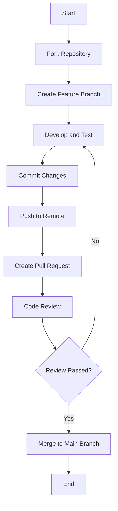

# Contributing to Cozeloop

Thank you for your interest in contributing to Cozeloop! This document provides guidelines for contributing to the project, covering contribution methods, project overview, development environment setup, code submission process, coding style and conventions, testing requirements, documentation requirements, and CI/CD processes.

## Ways to Contribute

You can contribute to the Cozeloop project in several ways:

* Submit and vote for new feature ideas
* Create and comment on issues
* Submit pull requests
* Improve documentation and code comments
* Participate in code reviews

Improvements to the core application, and documentation are all welcome. If you have any questions, please contact the project maintainers.

Before making significant changes, please open an issue to discuss your proposed changes. Make sure tests pass before submitting a pull request.

## Project Overview

You could go to [README](./README.md) to find more information.

## Code Submission Process

### Submission Process

<details>
<summary>Detailed Submission Process (Click to expand)</summary>

1. Create a feature branch from the `main` branch:
   ```bash
   git checkout main
   git pull
   git checkout -b feat/your-feature-name
   ```

2. Develop and commit on the feature branch

3. Ensure the code passes all tests:
   ```bash
   cd ./backend && go test -gcflags="all=-N -l" ./... 
   ```

4. Push the branch to the remote repository:
   ```bash
   git push origin feat/your-feature-name
   ```

5. Create a Pull Request to the `main` branch

6. After code review is passed, merge into the `main` branch
</details>



### Commit Message Format

Follow the [Conventional Commits](https://www.conventionalcommits.org/en/v1.0.0/) best practices:

```
<type>[optional scope]: <description>

[optional body]

[optional footer]
```

Types include:
* `feat`: New feature
* `fix`: Bug fix
* `docs`: Documentation changes
* `style`: Changes that do not affect code meaning (whitespace, formatting, etc.)
* `refactor`: Code changes that neither fix a bug nor add a feature
* `perf`: Code changes that improve performance
* `test`: Adding or correcting tests
* `chore`: Changes to the build process or auxiliary tools

Example:
```
feat(api): add user authentication interface

Implement JWT-based user authentication mechanism, including login, logout, and token refresh functionality.

Closes #123
```

## Coding Style and Conventions

### Go Code Style

* Follow recommendations in [Effective Go](https://golang.org/doc/effective_go) and [Go Code Review Comments](https://github.com/golang/go/wiki/CodeReviewComments)
* Use `gofmt` or `goimports` to format code
* Use `golint` and `go vet` to check code quality
* Package names should be short, clear, all lowercase, with no underscores or mixed case
* File names should be all lowercase, with words separated by underscores

### Project-Specific Conventions

* API paths follow RESTful design principles
* Error handling uses the `errorn` package in the project
* Dependency injection uses the `wire` package
* Database operations use the `gorm` package

### File Organization

* Business logic code goes in the `modules` directory, organized by functional modules
* Common utilities and helper functions go in the `pkg` directory
* API definitions and handlers go in the `api` directory
* Infrastructure code (database, cache, etc.) goes in the `infra` directory
* Follow the principle of Domain-Driven Design

## Testing Requirements

### Unit Tests

* All public functions and methods should have unit tests
* Test files should be placed in the same directory as the code being tested, named `xxx_test.go`
* Use the Go standard library's `testing` package to write tests
* Use table-driven testing methods to handle multiple test cases
* It is better to Use mockgen to generate mock struct instead of using patch

Run unit tests:
```bash
cd ./backend && go test  -gcflags="all=-N -l" ./...
```

## Documentation Requirements

### Code Comments

* All exported functions, methods, types, and constants should better have comments
* Comments should start with the name of the item being documented and be complete sentences
* Use [GoDoc](https://blog.golang.org/godoc) format for writing comments

Example:
```go
// UserService provides operations related to users.
type UserService struct {
    // ...
}

// Create creates a new user and returns the user ID.
// If the user already exists, it returns ErrUserAlreadyExists.
func (s *UserService) Create(ctx context.Context, user *User) (int64, error) {
    // ...
}
```

## CI/CD

### Continuous Integration

The project uses a CI system for automated testing and building. Each Pull Request triggers the following checks:

* Unit tests
* Integration tests
* Build check

## License and CLA

Cozeloop is licensed under the [Apache 2.0 License](LICENSE). By submitting code to the project, you agree that your contributions will be available under this license.

### Contributor License Agreement

Before your contribution can be accepted, you need to agree that:

1. You have the right to submit the contribution under the Apache 2.0 license
2. The contribution is your original work or you have the right to submit it
3. You grant the project maintainers the right to distribute your contribution under the project's license

## Communication Channels

For questions, discussions, or assistance, please use the following channels:

* **GitHub Issues**: For bug reports and feature requests
* **GitHub Discussions**: For general questions and discussions

## Maintainers

If you have questions or need help, please contact the project maintainers.

---

Thank you for contributing to the Cozeloop project!
