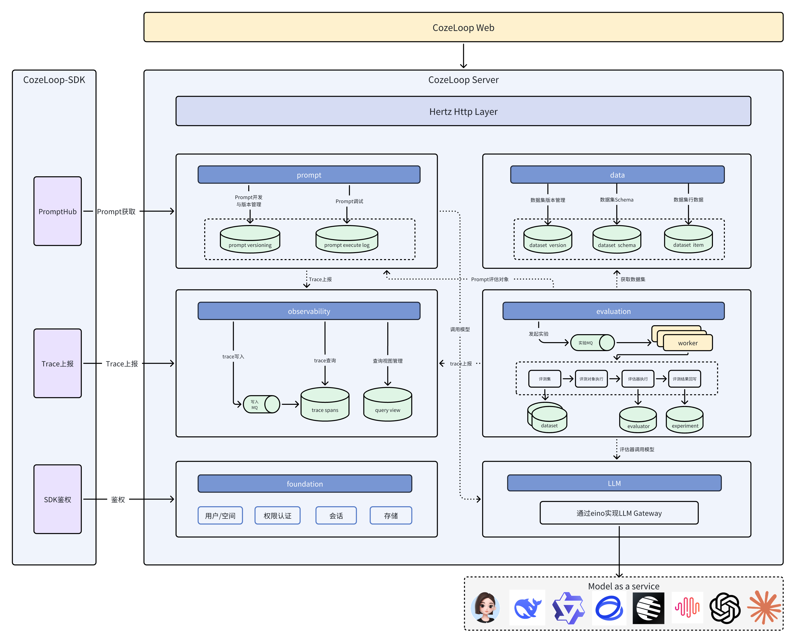

<div align="center">
<h1>Cozeloop</h1>
<p><strong> AI Agent 开发与运维的平台级解决方案</strong></p>
<p>
  <a href="#核心功能">核心功能</a> •
  <a href="#系统架构">系统架构</a> •
  <a href="#快速开始">快速开始</a> •
  <a href="#贡献指南">贡献指南</a>
</p>
<p>
  
  
</p>

[English](README.md) | 中文

</div>

## 项目概述

**Cozeloop** 是一个面向开发者，专注于AI Agent 开发与运维的平台级解决方案。该平台通过提供全生命周期的管理能力，帮助开发者更高效地开发和运维
AI Agent，极大简化了 AI Agent 的开发流程，提升了 AI Agent 的运行效果和稳定性。通过 Cozeloop，您可以：

- **Prompt开发**：为开发者提供从编写、调试到版本管理的全流程支持
- **评测**：提供系统化的评测能力，能够对评估对象进行多维度评测
- **观测**：提供了全链路执行过程的可视化观测能力，包含模型调用，工具执行等关键信息

Cozeloop 采用 Go 语言开发，基于微服务架构，为 AI 研究团队、产品开发团队和质量保证团队提供强大而灵活的 AI 应用评估工具。

## 核心功能

### 数据集管理

* **多样化数据集支持**：支持评估数据集创建、导入和管理
* **版本控制**：数据集版本管理，确保实验可重现性
* **结构化存储**：高效组织和检索评估数据

### 评估实验

* **实验配置**：灵活定义评估实验参数和目标
* **批量执行**：高效执行大规模评估任务
* **结果追踪**：详细记录实验过程和结果

### 模型集成

* **多模型支持**：通过 Eino 框架集成多种 LLM 模型
* **统一接口**：标准化的模型调用接口，简化集成流程
* **参数配置**：灵活调整模型参数和配置

### 提示词管理

* **提示词模板**：创建和管理提示词模板
* **版本控制**：提示词版本历史追踪
* **协作编辑**：团队协作优化提示词

### 可观测性

* **性能监控**：追踪 AI 应用响应时间、成功率等关键指标
* **异常检测**：识别并报告 AI 应用的异常行为和结果
* **实验追踪**：完整记录评测实验过程包含其中间结果和输出

## 系统架构

Cozeloop 采用微服务架构，基于领域驱动设计（DDD）原则构建，提供了 AI 应用开发运维一站式平台，整体架构如下：


整体可以分为三个部分：

- **平台**：平台提供了一整套 AI 应用的解决方案，包含各模块服务和基础组件部署
- **SDK**：当前提供的[SDK](https://loop.coze.cn/open/docs/cozeloop/sdk)修改其中初始化参数即可无缝和开源平台对接。
- **LLM**：主流的大模型，配置密钥后可使用对应大模型调用

### 模块分层

```
backend/
├── api/         # API 接口定义和实现
│   ├── handler/ # API 处理
│   └── router/  # API 路由
├── cmd/         # 应用入口和服务启动
├── modules/     # 核心业务模块
│   ├── data/         # 数据集模块
│   │    │── application/ #应用服务层
│   │    │── domain/      #领域模型层
│   │    │── infra/       #基础设施层
│   │    └── pkg/         #公共工具层
│   ├── evaluation/   # 评测模块
│   ├── foundation/   # 基建模块
│   ├── llm/          # LLM模块
│   ├── observability/# 观测模块
│   └── prompt/       # PE模块
├── infra/      # 基础设施层
│   ├── db/     # 数据库
│   ├── mq/     # 消息队列
│   ├── redis/  # Redis客户端
│   └── ck/     # ClickHouse客户端
└── pkg/        # 通用工具包和库
```

当前后端服务总共有六个业务模块，各模块职责如下：

- **data**：数据集模块: 负责数据集的创建/管理
- **evaluation**：评测模块: 负责对Prompt等评估对象进行评估试验
- **observability**：观测模块: 负责可视化的全链路请求记录
- **prompt**：Prompt模块: 负责提示词的开发/调试
- **llm**：LLM管理模块: 负责大模型的管理/调用
- **foundation**：基建模块: 负责用户/权限等基础功能

每个业务模块都遵循以下分层架构：

- **application**：应用服务层，协调领域对象完成业务流程
- **domain**：领域模型层，定义核心业务实体和业务逻辑
- **infra**：基础设施层，提供技术实现和外部服务集成
- **pkg**：模块特定的公共包

### 基础组件

* **后端框架**：
    * Hertz ( Cloudwego 高性能 HTTP 框架)
    * Kitex ( Cloudwego 高性能 RPC 框架)
* **数据存储**：
    * MySQL：结构化数据存储
    * ClickHouse：高性能分析数据存储
    * Redis：缓存和临时数据
    * MinIO：对象存储
    * RocketMQ: 消息队列
* **容器化**：Docker 和 Docker Compose

## 快速开始

参考[快速开始](./docs/quick_start.cn.md)获得更详细的内容。

### 环境准备

确保您的系统已安装以下依赖：

- Docker 和 Docker Compose

### 代码克隆

```bash
# 克隆代码
git clone https://github.com/coze-dev/cozeloop.git

# 进入cozeloop目录下
cd cozeloop
```

### 模型配置

代码拉取后，需要先修改[模型配置](./conf/default/app/runtime/model_config.yaml)，详细信息参考[模型配置](./docs/llm_configuration.cn.md)，下面给出一个包含两个模型配置的示例：

```yaml
models:
  - id: 1
    name: "doubao"
    frame: "eino"
    protocol: "ark"
    protocol_config:
      api_key: "***" # Change It
      model: "***"   # Change It
    param_config:
      param_schemas:
        - name: "temperature"
          label: "生成随机性"
          desc: "调高温度会使得模型的输出更多样性和创新性，反之，降低温度会使输出内容更加遵循指令要求但减少多样性。建议不要与 “Top p” 同时调整。"
          type: "float"
          min: "0"
          max: "1.0"
          default_val: "0.7"
        - name: "max_tokens"
          label: "最大回复长度"
          desc: "控制模型输出的 Tokens 长度上限。通常 100 Tokens 约等于 150 个中文汉字。"
          type: "int"
          min: "1"
          max: "4096"
          default_val: "2048"
        - name: "top_p"
          label: "核采样概率"
          desc: "生成时选取累计概率达 top_p 的最小 token 集合，集合外 token 被排除，平衡多样性与合理性。"
          type: "float" #
          min: "0.001"
          max: "1.0"
          default_val: "0.7"
  - id: 2
    name: "openai"
    frame: "eino"
    protocol: "openai"
    protocol_config:
      api_key: "***"  # Change It
      model: "***"    # Change It
    param_config:
      param_schemas:
        - name: "temperature"
          label: "生成随机性"
          desc: "调高温度会使得模型的输出更多样性和创新性，反之，降低温度会使输出内容更加遵循指令要求但减少多样性。建议不要与 “Top p” 同时调整。"
          type: "float"
          min: "0"
          max: "1.0"
          default_val: "0.7"
        - name: "max_tokens"
          label: "最大回复长度"
          desc: "控制模型输出的 Tokens 长度上限。通常 100 Tokens 约等于 150 个中文汉字。"
          type: "int"
          min: "1"
          max: "4096"
          default_val: "2048"
        - name: "top_p"
          label: "核采样概率"
          desc: "生成时选取累计概率达 top_p 的最小 token 集合，集合外 token 被排除，平衡多样性与合理性。"
          type: "float" #
          min: "0.001"
          max: "1.0"
          default_val: "0.7"
```

### 部署服务

使用 Docker Compose 快速部署，更多部署模式和过程参考[快速开始](./docs/quick_start.cn.md)文档。

```bash
# 启动服务
docker compose up --build
```

服务启动后，可通过 `http://localhost:8082`访问平台。

### Prompt开发与调试
扣子罗盘提供了完整的提示词开发流程，参考[说明文档](https://loop.coze.cn/open/docs/cozeloop/create-prompt)进行Prompt的开发与调试。

### 发起评测实验

扣子罗盘的评测功能提供标准评测数据管理、自动化评估引擎和综合的实验结果统计，参考[说明文档](https://loop.coze.cn/open/docs/cozeloop/evaluation-quick-start)发起评测实验。

### Trace上报与查询

扣子罗盘支持对平台上创建的Prompt调试的自动上报以及支持和主流 AI 框架集成实现Trace的一键上报，参考[说明文档](https://loop.coze.cn/open/docs/cozeloop/trace-integrate)来上报Trace。

## 集成与扩展

### 模型支持与拓展

当前支持的模型和模型参数配置参考[模型配置](./docs/llm_configuration.cn.md)。

### SDK使用

当前线上我们提供了三个语言的[SDK](https://loop.coze.cn/open/docs/cozeloop/sdk)用于 Trace 上报等功能，对于开源平台SDK也完全可以使用，只需要初始化的时候修改部分配置即可。`APIBaseURL`为开源平台部署的后端地址，`WorkspaceId`使用开源平台创建的空间ID，`APIToken`为开源平台生成的个人令牌，后两者获取参考[SDK授权](https://loop.coze.cn/open/docs/cozeloop/authentication-for-sdk)，获取方式是基本一致的。

#### Go SDK

使用方式参考[Go SDK](https://loop.coze.cn/open/docs/cozeloop/go-sdk)。

```go
package main

import (
	"context"

	"github.com/coze-dev/cozeloop-go"
)

func main() {
	// 创建client
	client, err := cozeloop.NewClient(
		cozeloop.WithAPIBaseURL("http://localhost:8888"), // 开源服务部署Host:Port
		cozeloop.WithAPIToken("your api token"),                        // 在账号设置内可以申请
		cozeloop.WithWorkspaceID("your workspace id"),                     // 在URL中获得空间ID
		cozeloop.WithPromptTrace(true),
	)
	if err != nil {
		panic(err)
	}

	// 直接调用api
	ctx, span := client.StartSpan(context.Background(), "first_span", "custom")
	span.Finish(ctx)

	// 程序退出前，需要调用Close方法，否则可能造成trace数据上报丢失。Close后无法再执行任何操作。
	client.Close(ctx)
}
```

#### Python SDK

使用方式参考[Python SDK](https://loop.coze.cn/open/docs/cozeloop/python-sdk)。

```python
import cozeloop
import os

if __name__ == "__main__":
    # 设置相关环境变量
    os.environ["COZELOOP_WORKSPACE_ID"] = "your workspace id"
    os.environ["COZELOOP_API_TOKEN"] = "your api token"
    os.environ["COZELOOP_API_BASE_URL"] = "http://localhost:8888"
    
    # 创建client
    client = cozeloop.new_client()

    # 通过client调用api
    span = client.start_span("first_span", "custom")
    span.finish()

    # 程序退出前，需要调用Close方法，否则可能造成trace数据上报丢失。Close后无法再执行任何操作。
    cozeloop.close()
```

#### Node.js SDK

使用方式参考[Node.js SDK](https://loop.coze.cn/open/docs/cozeloop/quick-start-nodejs)。

```js
import { cozeLoopTracer } from '@cozeloop/ai';

cozeLoopTracer.initialize({
  /** workspace id, use process.env.COZELOOP_WORKSPACE_ID when unprovided */
  workspaceId: 'your workspace id',
  apiClient: {
    baseURL: 'http://localhost:8888',
    token: 'your api token',
  },
});
```

## 贡献指南

我们欢迎社区贡献，开发指南参见[Developer Guide](./docs/developer_guide.cn.md), 贡献指南参见[CONTRIBUTING.md](./CONTRIBUTING.md)，期待您的贡献！

## 安全

如果你在该项目中发现潜在的安全问题，或你认为可能发现了安全问题，请通过我们的[安全中心](https://security.bytedance.com/src)
或[漏洞报告邮箱](sec@bytedance.com)通知字节跳动安全团队。

请**不要**创建公开的 GitHub Issue。

## 联系我们

- 飞书用户群（[注册飞书](https://www.feishu.cn/)后扫码进群）


## 许可证

本项目采用 Apache 2.0 许可证 - 详情请参阅 [LICENSE](LICENSE) 文件。

## 致谢

感谢所有为 Cozeloop 项目做出贡献的开发者和社区成员。特别感谢：

- Eino 框架团队提供的 LLM 集成支持
- Cloudwego 团队开发的高性能框架
- 所有参与测试和反馈的用户
