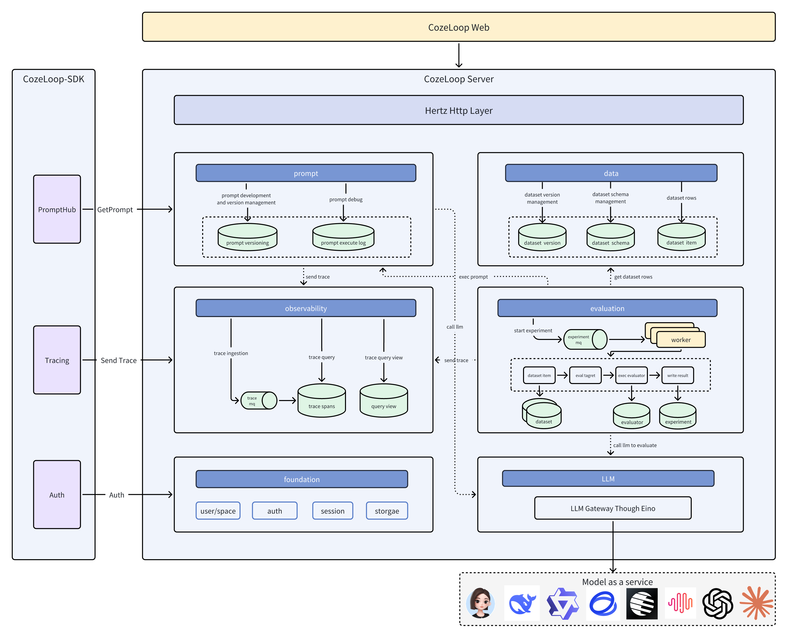

<div align="center">

<h1>Cozeloop</h1>
<p><strong>Platform-level Solution for AI Agent Development and Operations</strong></p>
<p>
  <a href="#core-features">Core Features</a> •
  <a href="#system-architecture">System Architecture</a> •
  <a href="#quick-start">Quick Start</a> •
  <a href="#contribution-guidelines">Contribution Guidelines</a>
</p>
<p>
  
  
</p>

English | [中文](README.cn.md)

</div>

## Project Overview

**Cozeloop** is a platform-level solution focused on AI Agent development and operations for developers. By providing full lifecycle management capabilities, the platform helps developers develop and operate AI Agents more efficiently, greatly simplifying the AI Agent development process and improving their operational effectiveness and stability. With Cozeloop, you can:

- **Prompt Development**: Provides end-to-end support from writing and debugging to version management
- **Evaluation**: Offers systematic evaluation capabilities for multi-dimensional assessment
- **Observability**: Provides visualization of the entire execution process, including model calls, tool execution, and other key information

Cozeloop is developed in Go language, based on a microservice architecture, providing powerful and flexible AI application evaluation tools for AI research teams, product development teams, and quality assurance teams.

## Core Features

### Dataset Management

* **Diverse Dataset Support**: Create, import, and manage evaluation datasets in multiple formats
* **Version Control**: Dataset version management ensuring experiment reproducibility
* **Structured Storage**: Efficient organization and retrieval of evaluation data

### Evaluation Experiments

* **Experiment Configuration**: Flexibly define evaluation experiment parameters and objectives
* **Batch Execution**: Efficiently execute large-scale evaluation tasks
* **Result Tracking**: Detailed recording of experiment processes and results

### Model Integration

* **Multi-model Support**: Integrate various LLM models through the Eino framework, including OpenAI/DeepSeek, etc.
* **Unified Interface**: Standardized model calling interface, simplifying integration
* **Parameter Configuration**: Flexible adjustment of model parameters and configurations

### Prompt Management

* **Prompt Templates**: Create and manage reusable prompt templates
* **Version Control**: Track prompt version history
* **Collaborative Editing**: Team collaboration for prompt optimization

### Observability

* **Performance Monitoring**: Track key metrics such as AI application response time and success rate
* **Anomaly Detection**: Identify and report abnormal behaviors and results in AI applications
* **Experiment Tracking**: Complete recording of evaluation experiment processes including intermediate results and outputs

## System Architecture

Cozeloop adopts a microservice architecture, built on Domain-Driven Design (DDD) principles, providing a one-stop platform for AI application development and operations. The overall architecture is as follows:


The system can be divided into three parts:
- **Platform**: The platform provides a complete AI application solution, including various module services and basic component deployment
- **SDK**: The current [SDK](https://github.com/coze-dev/cozeloop-go) can seamlessly integrate with the open-source platform by modifying the [target address](https://github.com/coze-dev/cozeloop-go/blob/main/client.go#L180)
- **LLM**: Mainstream large models, which can be used after configuring the corresponding keys

### Module Layers

```
backend/
├── api/         # API interface definitions and implementations
│   ├── handler/ # API handlers
│   └── router/  # API routes
├── cmd/         # Application entry points and service startup
├── modules/     # Core business modules
│   ├── data/        # Dataset module
│   │    │── application/ # Application service layer
│   │    │── domain/      # Domain model layer
│   │    │── infra/       # Infrastructure layer
│   │    └── pkg/         # Common utilities layer
│   ├── evaluation/   # Evaluation module
│   ├── foundation/   # Foundation module
│   ├── llm/          # LLM module
│   ├── observability/# Observability module
│   └── prompt/       # PE module
├── infra/      # Infrastructure layer
│   ├── db/     # Database
│   ├── mq/     # Message queue
│   ├── redis/  # Redis client
│   └── ck/     # ClickHouse client
└── pkg/        # Common utilities and libraries
```

There are currently six business modules, with responsibilities as follows:
- **data**: Dataset module, responsible for dataset creation/management
- **evaluation**: Evaluation module, responsible for conducting prompt evaluation experiments
- **observability**: Observability module, responsible for visualizing full-chain request records
- **prompt**: Prompt management module, responsible for prompt development/debugging
- **llm**: LLM model management module, responsible for managing/calling different large models
- **foundation**: Foundation module, responsible for basic functionality like user/permissions

Each business module follows this layered architecture:
- **application**: Application service layer, coordinating domain objects to complete business processes
- **domain**: Domain model layer, defining core business entities and business logic
- **infra**: Infrastructure layer, providing technical implementation and external service integration
- **pkg**: Module-specific common packages

### Basic Components

* **Backend Framework**:
    * Hertz (High-performance HTTP framework developed by Cloudwego)
    * Kitex (RPC framework developed by Cloudwego)
* **Data Storage**:
    * MySQL: Structured data storage
    * ClickHouse: High-performance analytical data storage
    * Redis: Cache and temporary data
    * MinIO: Object storage
    * RocketMQ: Message queue
* **Containerization**: Docker and Docker Compose

## Quick Start

### Environment Preparation

Ensure your system has the following dependencies installed:

- Docker and Docker Compose

### Model Configuration

After fetching the source code, you need to configure the model parameters first. Modify the model configuration file [```conf/default/app/runtime/model_config.yaml```](conf/default/app/runtime/model_config.yaml). For detailed information, please refer to the [Model Configuration Documentation](./docs/llm_configuration.md). Taking the Ark model configuration as an example, modify the file as follows:

```yaml
models:
  - id: 1    # Starting from 1
    workspace_id: 0
    name: "doubao"
    ability:
      max_context_tokens: 65536
      max_input_tokens: 65536
      max_output_tokens: 8192
      function_call: false
      json_mode: false
      multi_modal: true
      ability_multi_modal:
        image: true
        ability_image:
          url_enabled: true
          binary_enabled: true
          max_image_size: 20 # MB
          max_image_count: 20
    frame: "eino"
    protocol: "ark"
    protocol_config:
      base_url: "https://ark.cn-beijing.volces.com/api/v3"
      api_key: "***" # API KEY (Change it)
      model: "doubao-1-5-pro-256k-250115"
      protocol_config_ark:
        region: "cn-beijing"
    scenario_configs:
      default:
        scenario: "default"
        quota:
          qpm: 0
          tpm: 0
        unavailable: false
      evaluator:
        scenario: "evaluator" # Available for evaluator scenario
        quota:
          qpm: 0
          tpm: 0
        unavailable: false
    param_config: # Optional parameter configuration
      param_schemas:
        - name: "temperature"
          label: "Generation Randomness"
          desc: "Increasing temperature makes the model's output more diverse and creative, while decreasing it makes the output more focused on following instructions but less diverse. It's recommended not to adjust this parameter simultaneously with 'Top p'."
          type: "float"
          min: "0"
          max: "1.0"
          default_val: "0.7"
        - name: "max_tokens"
          label: "Maximum Response Length"
          desc: "Controls the maximum length of model output in Tokens. Typically, 100 Tokens is approximately equal to 150 Chinese characters."
          type: "int"
          min: "1"
          max: "8192"
          default_val: "2048"
```

After completing the configuration, proceed with the following steps to start the service and experience the features. You can check if your configured model is visible and available in the Playground. If it's not available, troubleshoot the configuration based on the error message.

### Deploy Services

Quickly deploy the complete environment using Docker Compose:

```bash
# Clone repository
git clone https://github.com/coze-dev/cozeloop.git
cd cozeloop

# Modify the model configuration file as described above

# Start services
docker compose up
```

After services start, you can access the platform at `http://localhost:8082`.

### Prompt Development and Debugging

Cozeloop provides a complete prompt development workflow. Please refer to the [documentation](https://loop.coze.cn/open/docs/cozeloop/create-prompt) for prompt development and debugging.

### Launch Evaluation Experiments

Cozeloop's evaluation feature provides standardized evaluation data management, automated evaluation engine, and comprehensive experiment result statistics. Please refer to the [documentation](https://loop.coze.cn/open/docs/cozeloop/evaluation-quick-start) to launch evaluation experiments.

### Trace Reporting and Query

Cozeloop supports automatic reporting of prompt debugging created on the platform and integration with mainstream AI frameworks for one-click trace reporting. Please refer to the [documentation](https://loop.coze.cn/open/docs/cozeloop/trace-integrate) for trace reporting.

## Integration and Extension

### LLM Model Support and Extension

The currently supported models are as follows. For model configuration modification and model expansion, please refer to the [doc](./docs/llm_configuration.md).

| Model       | Support Status |
|------------|---------------|
| Ark/ArkBot | ✅            |
| OpenAI     | ✅            |
| DeepSeek   | ✅            |
| Claude     | ✅            |
| Gemini     | ✅            |
| Ollama     | ✅            |
| Qwen       | ✅            |
| Qianfan    | ✅            |

### Using Cozeloop SDK
Taking Go SDK as an example, you can seamlessly integrate with the open-source platform by modifying APIBaseURL/APIToken/WorkspaceID to corresponding values.
```go
package main

import (
    "context"

    "github.com/coze-dev/cozeloop-go"
)

func main() {
    // Create client
    client, err := cozeloop.NewClient(
        cozeloop.WithAPIBaseURL("http://localhost:8888"), // Open-source service deployment Host:Port
        cozeloop.WithAPIToken(""),                        // Can be applied in account settings
        cozeloop.WithWorkspaceID(""),                     // Get workspace ID from URL
        cozeloop.WithPromptTrace(true),
    )
    if err != nil {
        panic(err)
    }

    // Direct API call
    ctx, span := client.StartSpan(context.Background(), "first_span", "custom")
    span.Finish(ctx)

    // Before program exit, call Close method to avoid trace data loss. No operations can be performed after Close.
    client.Close(ctx)
}
```

## Contribution Guidelines

We welcome community contributions. Please see [Developer Guide](./docs/developer_guide.md) and [CONTRIBUTING.md](./CONTRIBUTING.md) for details. We look forward to your contributions!

## Security
If you discover potential security issues in this project, or believe you may have found a security issue, please notify the ByteDance security team through our [Security Center](https://security.bytedance.com/src)
or [vulnerability reporting email](sec@bytedance.com).

Please **do not** create public GitHub Issues.

## Contact Us
- Feishu user group (Scan QR code after [registering for Feishu](https://www.feishu.cn/))


## License

This project is licensed under the Apache 2.0 License - see the [LICENSE](LICENSE) file for details.

## Acknowledgments

Thanks to all developers and community members who have contributed to the Cozeloop project. Special thanks to:

- The Eino framework team for providing LLM integration support
- The Cloudwego team for developing high-performance frameworks
- All users who participated in testing and provided feedback
