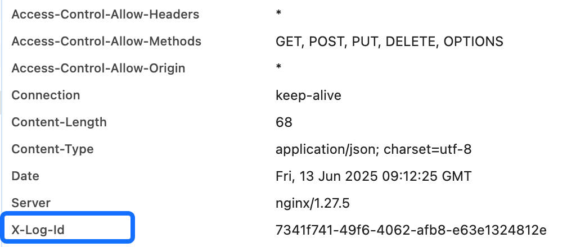

# Developer Guide

English | [中文](developer_guide.cn.md)

This document provides the developer guide for the Cozeloop project, including environment setup, code development, testing, and troubleshooting.

## Environment Setup

### Development Environment Setup

1. **Install Dependencies**

- Install docker and docker compose correctly according to your system. Refer to [Quick Start](quick_start.md#install-dependencies) for details.
- Install Go 1.23.4 or higher, configure GOPATH, and add ${GOPATH}/bin to your PATH environment variable to ensure installed binary tools can be found and executed.

2. **Clone Repository**

    ```bash
    git clone https://github.com/coze-dev/cozeloop.git
    
    cd cozeloop
    ```

3. **Configure Models**

Configure model parameters as needed according to [Model Configuration](llm_configuration.md).

4. **Start Service**

Start the service according to [Start Service](quick_start.md#start-service) instructions. For development scenarios, you can use development mode or debug mode.

    ```bash
    # Development mode
    RUN_MODE=dev docker compose up -d --build

    # Debug mode
    RUN_MODE=debug docker compose up -d --build
    ```

5. **Access Service**

Frontend access port is `8082`, backend access port is `8888`. You can access the platform via `http://localhost:8082`.

### IDE Configuration

Recommended IDEs are VSCode or GoLand:

   - Install Go plugin
   - Install Docker plugin
   - Configure Go development environment

## Code Development

### Project Structure

```
├── backend/          # Backend code
│   ├── api/          # API interface definitions and implementations
│   │   ├── handler/  # API handlers
│   │   └── router/   # API routing
│   ├── cmd/          # Application entry and service startup
│   │   ├── conf      # Module configuration files
│   │   └── main.go   # Entry function
│   ├── modules/      # Core business modules
│   │   ├── data/     # Dataset module
│   │   │   ├── application/ # Application service layer
│   │   │   ├── domain/      # Domain model layer
│   │   │   ├── pkg /        # Common utilities layer
│   │   │   └── infra/       # Infrastructure layer
│   │   ├── evaluation/    # Evaluation module
│   │   ├── foundation/    # Foundation module
│   │   ├── llm/           # LLM module
│   │   ├── observability/ # Observability module
│   │   └── prompt/        # PE module
│   ├── pkg/            # Common utilities and libraries
│   └── script/         # Scripts
│       ├── errorx/     # Error code definitions and generation tools
│       └── kitex/      # Kitex code generation tools
├── conf/             # Basic component configuration files
├── docs/             # Documentation
├── frontend/         # Frontend code
└── idl/              # IDL interface definition files
```

### Development Standards

1. **Code Structure**
    - The repository uses a Monorepo approach, with both frontend and backend code in the same repository
    - Backend code design follows DDD principles, adhering to layered architecture. Each business module follows the following layered architecture:
        - application: Application service layer, coordinating domain objects to complete business processes
        - domain: Domain model layer, defining core business entities and business logic
        - infra: Infrastructure layer, providing technical implementations and external service integration
        - pkg: Module-specific common packages

2. **Go Standards**
    - Go code standards can be referenced from [Google Standards](https://google.github.io/styleguide/go/best-practices.html)
    - Use formatting tools like `gofmt` for code formatting

3. **IDL Standards**
    - Service Definition
        - Service names use camelCase
        - One Thrift file should only define one Service, except for extends aggregation
    - Method Definition
        - Interface names use camelCase
        - Interfaces can only have one parameter and one return value, both must be custom Struct types
        - Input parameters must be named {Method}Request, return values must be named {Method}Response
        - Each Request type must include a Base field, type base.Base, field number 255, optional type
        - Each Response type must include a BaseResp field, type base.BaseResp, field number 255
    - Struct Definition
        - Struct names use camelCase
        - Field names use snake_case
        - New fields must be set as optional, required is prohibited
        - Modifying existing field IDs and types is prohibited
    - Enum Definition
        - Recommend using typedef to define enum values
        - Enum value names use camelCase, with underscore connecting type and name
    - API Definition
        - Use Restful style for API definition
        - Reference existing module API definitions for consistent style
    - Annotation Definition
        - Can reference [Kitex](https://www.cloudwego.io/zh/docs/kitex/tutorials/code-gen/validator/) supported annotations
        - Can reference [Hertz](https://www.cloudwego.cn/zh/docs/hertz/tutorials/toolkit/annotation/#%E6%94%AF%E6%8C%81%E7%9A%84-api-%E6%B3%A8%E8%A7%A3) supported annotations

   Example specification:
   ```thrift
    # Single Service
    typedef string EnumType(ts.enum="true") 

    const EnumType EnumType_Text = "Text"

    struct ExampleRequest {
        1: optional i64 id
    
        255: optional base.Base base
    }

    struct ExampleResponse {
        1: optional string name
        2: optional EnumType enum_type

        255: base.BaseResp base_resp
    }

    service ExampleService {
        ExampleMethod(1: ExampleRequest) (2: ExampleResponse)
    }

    # Multiple Services
    service ExampleAService extends idl_a.AService{}
    service ExampleBService extends idl_b.BService{}
    ```

4. **Unit Test Standards**
    - UT Function Naming
        - Regular functions named Test{FunctionName}(t *testing.T)
        - Object methods named Test{ObjectName}_{MethodName}(t *testing.T)
        - Benchmark test functions named Benchmark{FunctionName}(b *testing.B)
        - Benchmark test objects named Benchmark{ObjectName}_{MethodName}(b *testing.B)
    - File Naming
        - Test files have the same name as the tested file, with `_test.go` suffix, in the same directory
    - Test Design
        - Recommend using Table-Driven approach to define input/output, covering multiple scenarios
        - Use `github.com/stretchr/testify` to simplify assertion logic
        - Use `github.com/uber-go/mock` to generate Mock objects, avoid Patch stubbing when possible

   Test example:
    ```go
    func TestRetryWithMaxTimes1(t *testing.T) {
        type args struct {
            ctx context.Context
            max int
            fn  func() error
        }
        tests := []struct {
            name    string
            args    args
            wantErr bool
        }{
            {
                name: "test1",
                args: args{
                    max: 3,
                    fn: func() error {
                        return nil
                    }
                },
                wantErr: false,
            }
            // Add more test cases.
        }
        for _, tt := range tests {
            t.Run(tt.name, func(t *testing.T) {
                err := RetryWithMaxTimes(tt.args.ctx, tt.args.max, tt.args.fn)
                assert.Equal(t, tt.wantErr, err != nil)
            })
        }
    }
    ```

### Development Process

1. **Create Feature Branch**
    ```bash
    git checkout -b feat/your-feature-name
    ```

2. **Develop New Feature**
- If IDL modification is needed, modify IDL according to standards, then use scripts to generate code, which will generate both kitex and hertz code.

    ```bash
    cd ./backend/script/cloudwego
    ./code_gen.sh
    ```

- If dependency injection modification is needed, follow the current wire dependency injection approach, modify wire.go in the corresponding directory and regenerate code.

    ```bash
    # Modify overall initialization dependency injection
    cd ./backend/api/handler/coze/loop/apis
    wire
    # Modify submodule dependency injection
    cd ./backend/modules/observability/application
    wire
    ```
  
- Follow Go development standards for backend service development. If running in development mode, the backend service will automatically recompile and run. For other modes, you need to rebuild and run the image. It's recommended to use development mode for development.
    ```bash
    # Rebuild and run image, compilation time will be longer
    docker compose up app --build
    ```

- Before committing code, add unit tests with incremental coverage above 80%, ensuring all existing unit tests pass.

    ```bash
    cd backend/
    go test -gcflags="all=-N -l" -count=1 -v ./...
    ```

3. **Commit Code**

```bash
   git add .
   git commit -m "feat: add new feature"
```

4. **Merge Request**
   - Push to remote repository
   - Create Pull Request
   - Ensure CI passes
   - Wait for Code Review

## Testing Guide

### Unit Testing

1. **Run Tests**

    ```bash
   # Run all tests to ensure they pass
    cd backend/
    go test -gcflags="all=-N -l" -count=1 -v ./...
    ```

2. **Test Coverage**
    ```bash
   # Generate test coverage report
   cd backend/
   go test -gcflags="all=-N -l" -coverprofile=coverage.out ./...
   go tool cover -html=coverage.out
   ```

### Functional Testing
   
After local deployment, you can open the platform to test if each module's functionality is working properly:

   - Prompt Development and Debugging
     - Playground can debug normally
     - Prompt creation and management meets expectations
   - Evaluation Experiments
     - Create new datasets
     - Add new evaluators
     - Create new experiments to evaluate recently created Prompts
     - Complete experiments and view analysis reports
   - Trace Reporting and Query
     - Check if Traces are displayed in the Trace interface when selecting Prompt development

## Troubleshooting

### Container Status

The following containers will be present at startup:
```text
cozeloop-app: Backend service
cozeloop-nginx: Nginx proxy
cozeloop-mysql: MySQL database
cozeloop-redis: Redis cache
cozeloop-clickhouse: Clickhouse storage
cozeloop-minio: Object storage
cozeloop-namesrv: RocketMQ nameserver
cozeloop-broker: RocketMQ broker
```

Check if all containers have started and are in healthy status:
```bash
docker ps -a
```

If any service is in unhealthy status, check the corresponding component's logs to identify the error:
```bash
docker logs cozeloop-app # Backend service logs
docker logs cozeloop-nginx # Nginx logs
docker logs cozeloop-mysql # MySQL logs
docker logs cozeloop-redis # Redis logs
docker logs cozeloop-clickhouse # Clickhouse logs
docker logs cozeloop-minio # MinIO logs
docker logs cozeloop-namesrv # RocketMQ nameserver logs
docker logs cozeloop-broker # RocketMQ broker logs
```

### Service Logs

After all containers are running normally, the main focus is on the backend service's runtime logs. If there are API errors, we can check the service container's logs for error messages:

   ```bash
   docker logs cozeloop-app
   ```   
   
If there are API errors on the page, you can press F12 to enter the browser console, check the corresponding error request, and get the LogID from the response header in `x-log-id`. After getting the logid, check the logs in the container. If the API is normal, you might not find the corresponding log:
   
   ```bash
   docker logs -f cozeloop-app | grep {logid}
   ```

### **Error Codes**

Server-side error definitions are in the errno directory of each module. If a request returns an error code, you can search for the error code in the project to quickly locate the issue, then use the log query method above to locate the specific problem.

### **SDK**

If you're testing the open-source platform through SDK integration, you can refer to the SDK's [error codes](https://loop.coze.cn/open/docs/cozeloop/error-codes) for quick issue identification. If it's a service issue, check the service logs for detailed troubleshooting.

## Contribution Guide

After carefully reviewing this document, if code standards and tests have passed, you can refer to [CONTRIBUTING.md](../CONTRIBUTING.md) to make your contribution. Thank you for your support.
