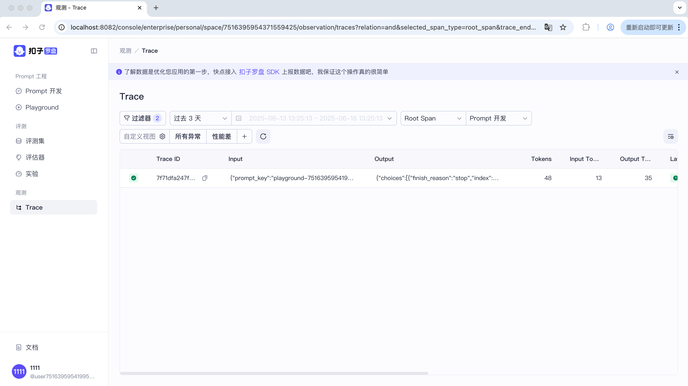

# 快速开始

[English](quick_start.md) | 中文

## 环境准备

### 安装依赖

能成功安装 Docker 和 Docker Compose即可。若安装过程中出现问题，可网上查阅资料，绝大部分都是Docker相关问题，建议使用较高版本的系统，有问题可联系我们。

1. Mac

    推荐使用 Docker Desktop 安装，参考 [Docker Desktop For Mac](https://docs.docker.com/desktop/setup/install/mac-install/) 安装指南。    

2. Linux
    
    参考 [Docker 安装指南](https://docs.docker.com/engine/install/) 和 [Docker Compose](https://docs.docker.com/compose/install/) 安装指南。    

3. Windows
    
    推荐使用 Docker Desktop 安装，参考 [Docker Desktop For Windows](https://docs.docker.com/desktop/setup/install/windows-install/) 安装指南。

## 快速部署

### 克隆代码
```bash
# 克隆代码
git clone https://github.com/coze-dev/cozeloop.git

# 进入cozeloop目录下
cd cozeloop
```

### 配置模型

首先需要进行模型的配置，否则启动后没有可选的模型供测试。可以参考模型[配置文档](llm_configuration.cn.md)进行配置。下面给出一个配置的示例，这个示例配置了两个模型：ark和openapi。
```yaml
models:
  - id: 1
    name: "doubao"
    frame: "eino"
    protocol: "ark"
    protocol_config:
      api_key: "***"  # Change It
      model: "***"    # Change It
    param_config:
      param_schemas:
        - name: "temperature"
          label: "生成随机性"
          desc: "调高温度会使得模型的输出更多样性和创新性，反之，降低温度会使输出内容更加遵循指令要求但减少多样性。建议不要与 “Top p” 同时调整。"
          type: "float"
          min: "0"
          max: "1.0"
          default_val: "0.7"
        - name: "max_tokens"
          label: "最大回复长度"
          desc: "控制模型输出的 Tokens 长度上限。通常 100 Tokens 约等于 150 个中文汉字。"
          type: "int"
          min: "1"
          max: "4096"
          default_val: "2048"
        - name: "top_p"
          label: "核采样概率"
          desc: "生成时选取累计概率达 top_p 的最小 token 集合，集合外 token 被排除，平衡多样性与合理性。"
          type: "float" #
          min: "0.001"
          max: "1.0"
          default_val: "0.7"
  - id: 2
    name: "openapi"
    frame: "eino"
    protocol: "openai"
    protocol_config:
      api_key: "***"  # Change It
      model: "***"    # Change It
    param_config:
      param_schemas:
        - name: "temperature"
          label: "生成随机性"
          desc: "调高温度会使得模型的输出更多样性和创新性，反之，降低温度会使输出内容更加遵循指令要求但减少多样性。建议不要与 “Top p” 同时调整。"
          type: "float"
          min: "0"
          max: "1.0"
          default_val: "0.7"
        - name: "max_tokens"
          label: "最大回复长度"
          desc: "控制模型输出的 Tokens 长度上限。通常 100 Tokens 约等于 150 个中文汉字。"
          type: "int"
          min: "1"
          max: "4096"
          default_val: "2048"
        - name: "top_p"
          label: "核采样概率"
          desc: "生成时选取累计概率达 top_p 的最小 token 集合，集合外 token 被排除，平衡多样性与合理性。"
          type: "float" #
          min: "0.001"
          max: "1.0"
          default_val: "0.7"
```

### 启动服务

这里提供了三种服务的启动模式。若启动过程中遇到了Docker/Docker Compose相关的问题，绝大部分都是环境配置/权限/网络问题，可网上查询相关解决方案，文末会放一些[常见问题](#常见问题)。首次启动需要拉取镜像以及本地镜像的构建，请耐心等待。如遇到镜像拉取文件，建议参照[镜像拉取](#镜像拉取失败)先拉取所需镜像再启动服务。

1. **开发模式 (默认模式)**

    开发模式下可以使用热部署，即当修改后端文件时(backend下的文件)，业务Docker会自动重新编译后端代码并重新启动，无需重新拉起 Docker。当修改前端文件时，需要使用[dev_reload.sh](../dev_reload.sh)去触发前端重新构建或者重新拉起服务。

   ```bash
   # 默认就是开发模式
   docker compose up --build
   # 加上RUN_MODE=dev，效果同上
   RUN_MODE=dev docker compose up --build
   # 如果需要在后台运行
   RUN_MODE=dev docker compose up --build -d
   ```
   
   启动成功后可以看到如下日志信息：
   
   
   修改文件后，可以看到如下日志，文件改动重新编译运行：
   

2. **调试模式**

    调试模式下可以使用远程单步调试，即可以在本地使用VSCode或者GoLand等IDE进行远程调试，下面会给出一个例子。注意，当服务起在本地时，如果系统为Mac且搭载M系列芯片，本地调试可能会失败。

   ```bash
   # 加上RUN_MODE=debug
   RUN_MODE=debug docker compose up --build
   # 如果需要在后台运行
   RUN_MODE=debug docker compose up --build -d
   ```
   
   启动成功后可以看到如下日志信息：
   

   以GoLand为例，如果进行远程调试。

   首先需要在GoLand新建一个Debug选项，选择Go Remote：
   
   然后根据你的环境填写信息，主要是启动服务的IP，服务端口就是40000:
   
   这时候点击应用运行即可，这时候在服务端能看到服务启动的日志。调试模式需要保证本地代码和部署侧代码一致。

3. **发布模式**

   发布模式就是正常启动服务模式，不再支持热部署和单步调试，属于稳定运行服务。

   ```bash
   # 加上RUN_MODE=release
   RUN_MODE=release docker compose up --build
   # 如果需要在后台运行
   RUN_MODE=release docker compose up --build -d
   ```

   启动成功后能看到如下日志信息：
   

4. **模式切换**

   当您想要切换运行模式的时候，需要先停止运行服务，然后再重新拉起服务，注意需要加`--build`参数重新编译镜像，如下所示：

   ```bash
   docker compose down
   # 按需传入启动模式
   RUN_MODE=release docker compose up --build
   ```

如果是在后台启动服务，那么在服务启动后，能看到这些信息，包含启动所需的各组件：
```text
[+] Running 18/18
✔ app                                      Built
✔ Network cozeloop_mynetwork               Created
✔ Volume "cozeloop_minio_config"           Created
✔ Volume "cozeloop_rocketmq_namesrv_data"  Created
✔ Volume "cozeloop_rocketmq_broker_data"   Created
✔ Volume "cozeloop_shared_frontend_dist"   Created
✔ Volume "cozeloop_redis_data"             Created
✔ Volume "cozeloop_mysql_data"             Created
✔ Volume "cozeloop_clickhouse_data"        Created
✔ Volume "cozeloop_minio_data"             Created
✔ Container cozeloop-mysql                 Healthy
✔ Container cozeloop-redis                 Healthy
✔ Container cozeloop-minio                 Healthy
✔ Container cozeloop-clickhouse            Healthy
✔ Container cozeloop-namesrv               Healthy
✔ Container cozeloop-broker                Healthy
✔ Container cozeloop-app                   Healthy
✔ Container cozeloop-nginx                 Started                                                                                                      
```

## 服务使用

服务启动后，前端监听`8082`端口，后端监听`8888`端口，打开`http://localhost:8082`即可访问平台，可看到如下界面：

   

注册账号密码即可登录，账号需要符合**邮箱规范**，注册后即可登录，如下所示：

   

点开Playground，即可选择我们之前已经配置的模型进行测试，如下所示：

   

选择模型后，即可进行对话调试Prompt，如下所示：

   

查看Trace，可看到调试过程中上报的Trace信息：

   

### Prompt开发与调试

扣子罗盘提供了完整的提示词开发流程，参考[说明文档](https://loop.coze.cn/open/docs/cozeloop/create-prompt)在开源平台进行Prompt的开发与调试。

### 发起评测实验

扣子罗盘的评测功能提供标准评测数据管理、自动化评估引擎和综合的实验结果统计，参考[说明文档](https://loop.coze.cn/open/docs/cozeloop/evaluation-quick-start)发起评测实验。

### Trace上报与查询

扣子罗盘支持对平台上创建的Prompt调试的自动上报以及支持和主流 AI 框架集成实现Trace的一键上报，参考[说明文档](https://loop.coze.cn/open/docs/cozeloop/trace-integrate)来上报Trace。


## 关闭服务

当您需要关闭服务的时候：
```bash
# 关闭服务, 数据还依然存在，重启服务时还能看到数据
docker compose down
# 关闭服务，并且删除数据
docker compose down -v
# 再查看容器列表，为空
docker ps -a
```

当您关闭后想要再启动服务的时候，可以参考部署服务中的使用方式。如果无需重新构建镜像，且无需更改启动模式，可以直接拉起服务，但是启动模式须保持一致:
```bash
# 重新拉起服务
docker compose up
# 重新拉起服务，且在后台运行
docker compose up -d 
```

## 常见问题

### 镜像拉取失败

如果遇到镜像拉取失败的问题，即`docker pull`失败，优先排查本地系统/网络问题，大部分问题都可以通过查询现有方案解决。建议尝试在本地直接拉取所有所需镜像，能够成功拉取后再使用 Docker Compose 启动服务。
```bash
docker pull golang:1.23.4
docker pull nginx:latest
docker pull clickhouse/clickhouse-server:latest
docker pull mysql:latest
docker pull minio/minio:latest
docker pull apache/rocketmq:latest
docker pull redis:latest
docker pull moby/buildkit:latest # arm架构跨平台需要
```