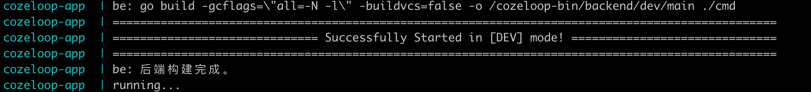
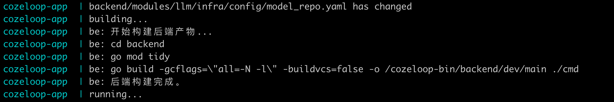
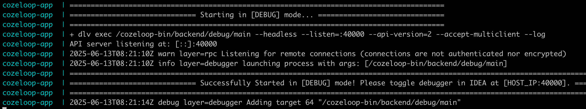
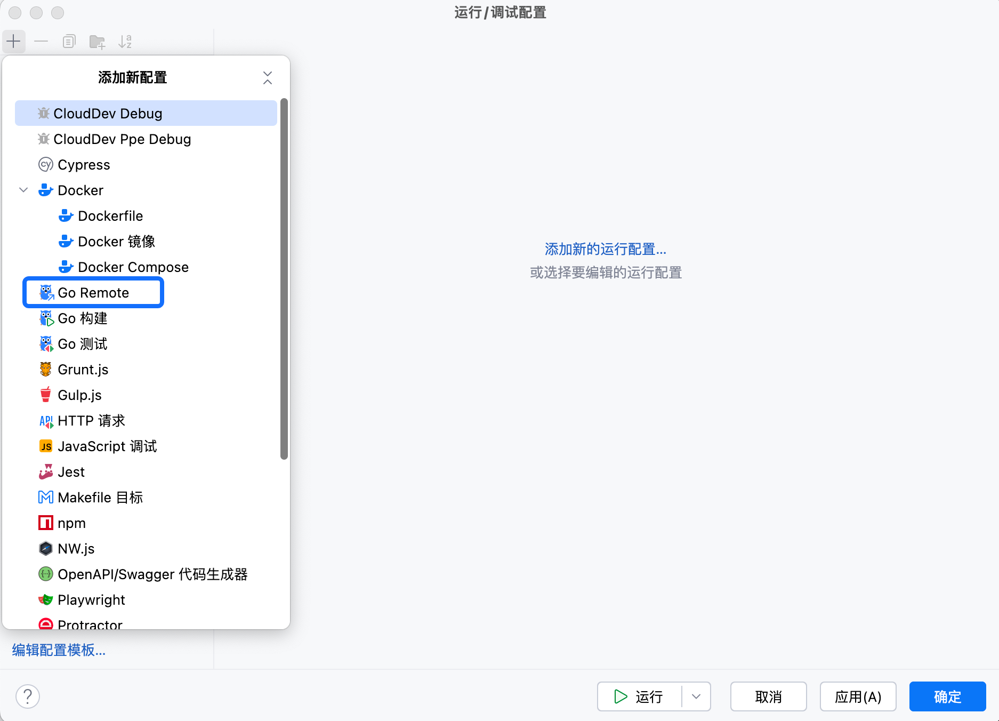
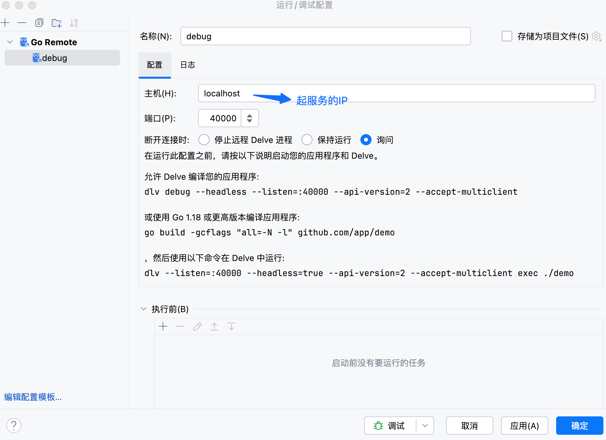
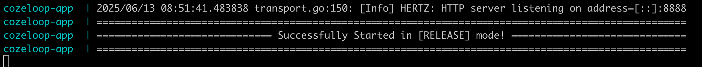
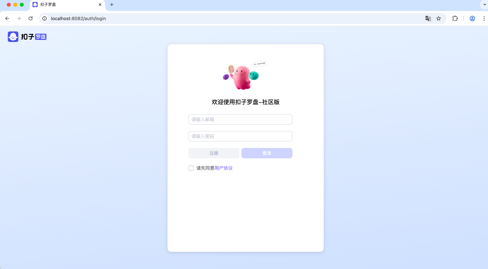
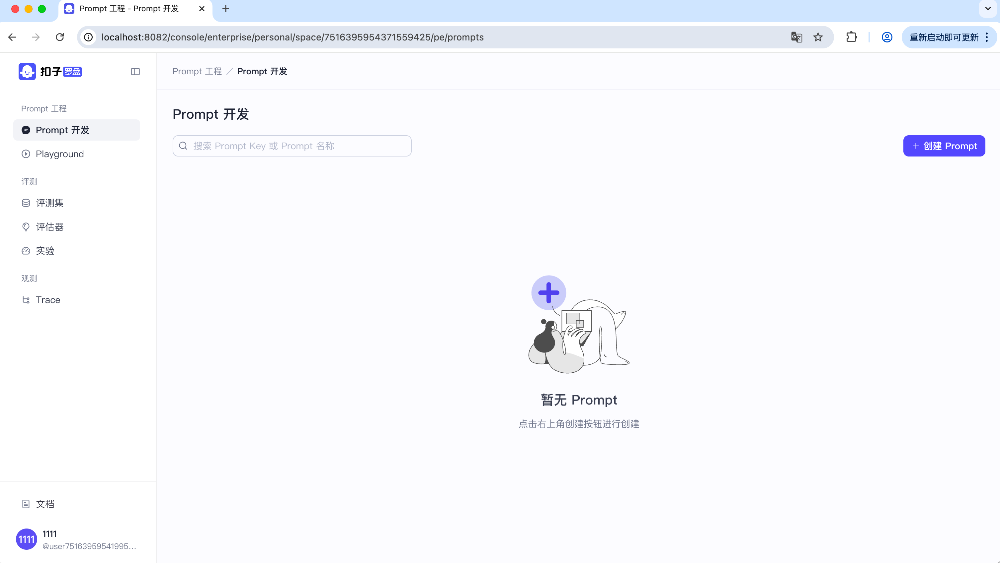
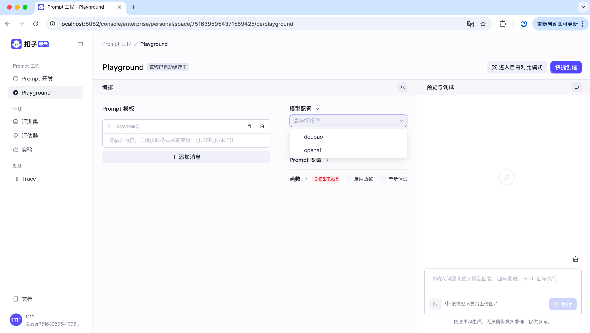
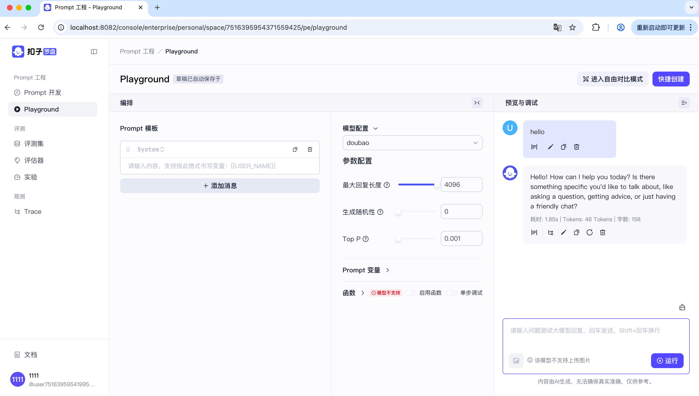

# Quick Start

English | [中文](quick_start.cn.md)

## Environment Setup

### Installing Dependencies

You only need to successfully install Docker and Docker Compose. If you encounter any issues during installation, you can search online for solutions. Most problems are Docker-related. We recommend using a newer version of your operating system. If you have any issues, feel free to contact us.

1. Mac

    We recommend using Docker Desktop. Please refer to the [Docker Desktop For Mac](https://docs.docker.com/desktop/setup/install/mac-install/) installation guide.

2. Linux
    
    Please refer to the [Docker Installation Guide](https://docs.docker.com/engine/install/) and [Docker Compose](https://docs.docker.com/compose/install/) installation guide.

3. Windows
    
    We recommend using Docker Desktop. Please refer to the [Docker Desktop For Windows](https://docs.docker.com/desktop/setup/install/windows-install/) installation guide.

## Quick Deployment

### Clone the Code
```bash
# Clone the code
git clone https://github.com/coze-dev/cozeloop.git

# Enter the cozeloop directory
cd cozeloop
```

### Configure Models

First, you need to configure the models, otherwise there won't be any models available for testing after startup. You can refer to the model [configuration documentation](llm_configuration.md) for setup. Below is a configuration example that sets up two models: ark and openapi.
```yaml
models:
  - id: 1
    name: "doubao"
    frame: "eino"
    protocol: "ark"
    protocol_config:
      api_key: "***" 
      model: "***"
    param_config:
      param_schemas:
        - name: "temperature"
          label: "Generation Randomness"
          desc: "Increasing temperature makes the model's output more diverse and creative, while decreasing it makes the output more focused on following instructions but less diverse. It's recommended not to adjust this parameter simultaneously with 'Top p'."
          type: "float"
          min: "0"
          max: "1.0"
          default_val: "0.7"
        - name: "max_tokens"
          label: "Maximum Response Length"
          desc: "Controls the maximum length of model output in Tokens. Typically, 100 Tokens is approximately equal to 150 Chinese characters."
          type: "int"
          min: "1"
          max: "4096"
          default_val: "2048"
        - name: "top_p"
          label: "Nucleus Sampling Probability"
          desc: "During generation, selects the minimum token set with cumulative probability reaching top_p, excluding tokens outside the set, balancing diversity and reasonability."
          type: "float"
          min: "0.001"
          max: "1.0"
          default_val: "0.7"
  - id: 2
    name: "openapi"
    frame: "eino"
    protocol: "openai"
    protocol_config:
      api_key: "***" 
      model: "***"
    param_config:
      param_schemas:
        - name: "temperature"
          label: "Generation Randomness"
          desc: "Increasing temperature makes the model's output more diverse and creative, while decreasing it makes the output more focused on following instructions but less diverse. It's recommended not to adjust this parameter simultaneously with 'Top p'."
          type: "float"
          min: "0"
          max: "1.0"
          default_val: "0.7"
        - name: "max_tokens"
          label: "Maximum Response Length"
          desc: "Controls the maximum length of model output in Tokens. Typically, 100 Tokens is approximately equal to 150 Chinese characters."
          type: "int"
          min: "1"
          max: "4096"
          default_val: "2048"
        - name: "top_p"
          label: "Nucleus Sampling Probability"
          desc: "During generation, selects the minimum token set with cumulative probability reaching top_p, excluding tokens outside the set, balancing diversity and reasonability."
          type: "float"
          min: "0.001"
          max: "1.0"
          default_val: "0.7"
```

### Start the Service

We provide three service startup modes. If you encounter Docker/Docker Compose related issues during startup, most of them are environment configuration/permission/network issues. You can search online for solutions, and we'll list some common issues at the end. The first startup requires pulling images and building local images, so please be patient.

1. **Development Mode (Default Mode)**

    In development mode, you can use hot deployment. When backend files are modified, the business Docker will automatically recompile the backend code and restart without needing to restart Docker. When frontend files are modified, you need to use [dev_reload.sh](../dev_reload.sh) to trigger frontend rebuild or restart the service.

   ```bash
   # Default is development mode
   docker compose up --build
   # Or with RUN_MODE=dev
   RUN_MODE=dev docker compose up --build
   # If you need to run in background
   RUN_MODE=dev docker compose up --build -d
   ```
   
   After successful startup, you'll see the following log information:
   
   
   After modifying files, you'll see the following log showing file changes being recompiled and run:
   

2. **Debug Mode**

    In debug mode, you can use remote step-by-step debugging. You can use IDEs like VSCode or GoLand for remote debugging. Here's an example.

   ```bash
    # Add RUN_MODE=debug
   RUN_MODE=debug docker compose up --build
   # If you need to run in background
   RUN_MODE=debug docker compose up --build -d
   ```
   
   After successful startup, you'll see the following log information:
   

    Taking GoLand as an example, for remote debugging:

    First, create a new Debug option in GoLand and select Go Remote:
    
    Then fill in the information according to your environment, mainly the service IP, and the service port is 40000:
    
    Click Apply to run. You'll see the service startup logs on the server side. Debug mode requires that local code matches the deployed code.

3. **Release Mode**

    Release mode is for normal service operation, without hot deployment and step-by-step debugging, suitable for stable service operation.

   ```bash
    # Add RUN_MODE=release
   RUN_MODE=release docker compose up --build
   # If you need to run in background
   RUN_MODE=release docker compose up --build -d
   ```

    After successful startup, you'll see the following log information:
    

## Service Usage

After the service starts, the frontend listens on port `8082` and the backend listens on port `8888`. Open `http://localhost:8082` to access the platform, where you'll see the following interface:
   

Register with an account and password to log in. The account must follow **email format**. After registration, you can log in as shown below:
   

Open Playground to select and test the models we configured earlier:
   

After selecting a model, you can start debugging Prompts through conversation:
  

### Prompt Development and Debugging

Cozeloop provides a complete prompt development workflow. Refer to the [documentation](https://loop.coze.cn/open/docs/cozeloop/create-prompt) to develop and debug Prompts on the open-source platform.

### Launch Evaluation Experiments

Cozeloop's evaluation feature provides standard evaluation data management, automated evaluation engine, and comprehensive experiment result statistics. Refer to the [documentation](https://loop.coze.cn/open/docs/cozeloop/evaluation-quick-start) to launch evaluation experiments.

### Trace Reporting and Query

Cozeloop supports automatic reporting of Prompt debugging created on the platform and integration with mainstream AI frameworks for one-click Trace reporting. Refer to the [documentation](https://loop.coze.cn/open/docs/cozeloop/trace-integrate) to report Traces.

## Common Issues

### Image Pull Failure

If you encounter image pull failures, i.e., `docker pull` fails, first check your local system/network issues. Most problems can be solved by searching for existing solutions, such as network connectivity issues. You can try pulling the image directly locally to see if it succeeds, and if it fails, continue troubleshooting based on the error message.
```bash
docker pull golang:1.23.4
```
